# 🖼️ The Diagram Bank — Every Figure You Must Draw in the Exam

*GitHub renders the Mermaid diagrams below live. Practice rule: redraw each diagram 2× on paper from memory during Hour 5. Diagrams = easy marks even when text escapes you.*

---

## UNIT 2 — AGENTS

### 1. Agent structure (draw for ANY "what is an agent" question)
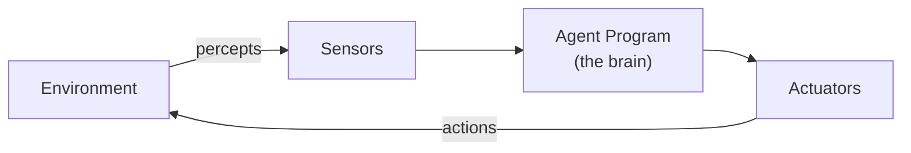
> Exam label: `agent = architecture + program`

### 2. Simple reflex agent
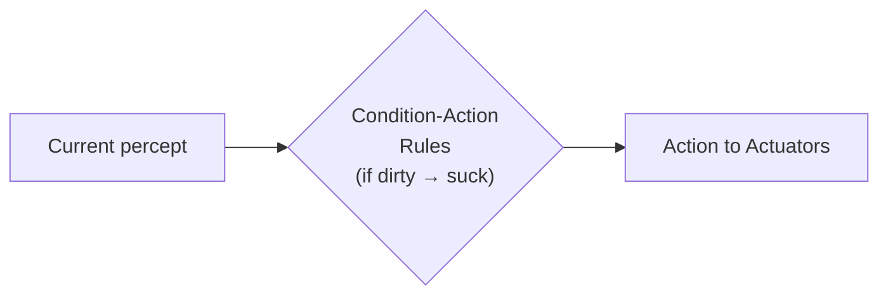

### 3. Model-based agent (has MEMORY)
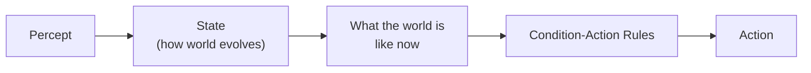

### 4. Goal-based agent (adds GOAL box)
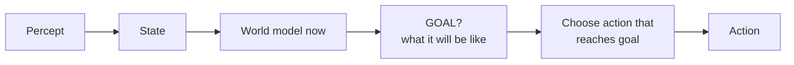

### 5. Utility-based agent (replaces GOAL with UTILITY)
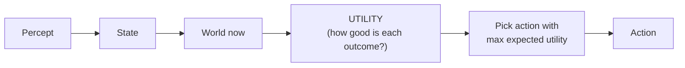

---

## UNIT 3 — SEARCH

### 6. The state-space graph (label every trace question like this)
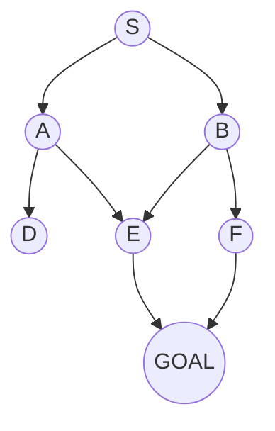
> In the exam: write g, h, f values BESIDE each node as you expand.

### 7. A* formula box (write this at the top of every A* answer)
```
┌─────────────────────────────────────┐
│  f(n) = g(n) + h(n)                 │
│  g = Gone  (real cost from START)   │
│  h = Hope  (estimated cost to GOAL) │
│  Admissible: h(n) ≤ true cost       │
│  → A* optimal if h is admissible    │
└─────────────────────────────────────┘
```

### 8. Hill Climbing problems (THE classic figure — draw all 4 arrows)
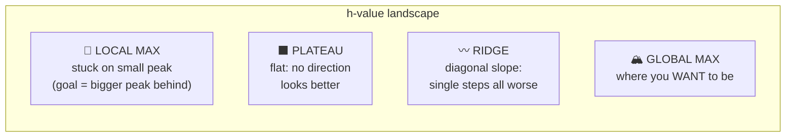
> Hand-drawn version: draw mountains, mark ⭕ where the climber stands stuck. Fixes: **random-restart, simulated annealing**.

### 9. Minimax tree (back up values from leaves)
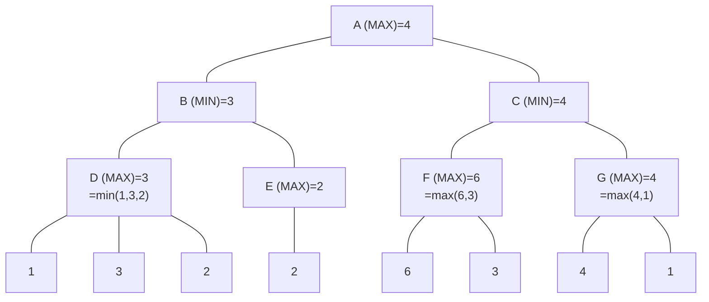
> 2081 Q11 pattern: leaves 1,3,2,6,3,4,1 → answer **4 via C→G→M**. Draw triangles: MAX layers ▽ pick biggest, MIN layers △ pick smallest.

### 10. Alpha-Beta pruning (mark ✂ pruned branches)
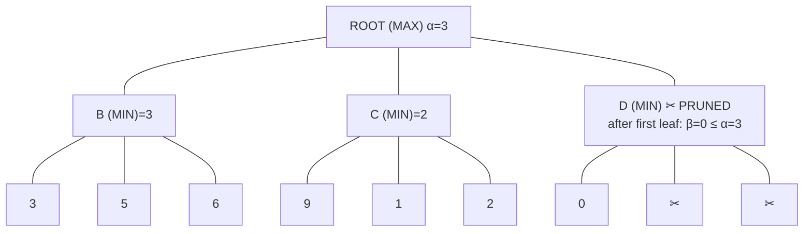
> **Prune when α ≥ β.** In exam: write current (α, β) beside EVERY node, slash pruned edges, state root's final α.

---

## UNIT 4 — KNOWLEDGE REPRESENTATION

### 11. Semantic net (2082 Q7 — animals)
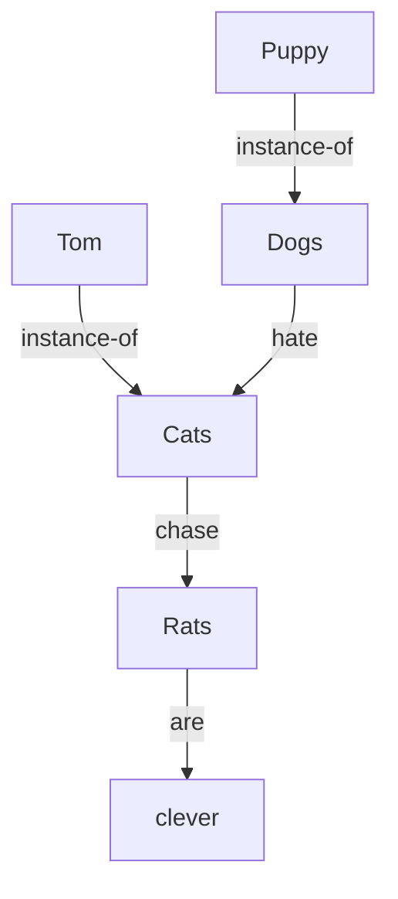
> Inference = follow arrows: "What does Tom hate?" → Tom is-instance-of Cats; Dogs hate Cats... → chase chain etc.

### 12. Semantic net (Model Q10 — Ram)
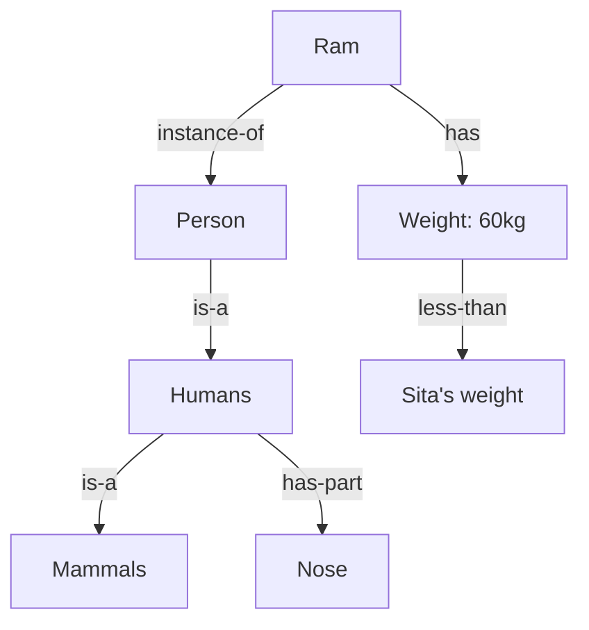

### 13. Frame (nested boxes — draw as boxes-in-boxes)
```
┌─────────────────────────────────────────────┐
│ ORGANIZATION: Tribhuvan University          │
│   org_type: Educational                     │
│  ┌───────────────────────────────────────┐  │
│  │ DEPARTMENT (is-a TU)                  │  │
│  │  ┌─────────────────────────────────┐  │  │
│  │  │ HR-DEPARTMENT (is-a DEPARTMENT) │  │  │
│  │  │   num_employees: 110            │  │  │
│  │  │   average_salary: 45000         │  │  │
│  │  │  ┌───────────────────────────┐  │  │  │
│  │  │  │ EMPLOYEE: Ram             │  │  │  │
│  │  │  │   age: 27  sex: male      │  │  │  │
│  │  │  │   dept: HR-DEPARTMENT     │  │  │  │
│  │  │  └───────────────────────────┘  │  │  │
│  │  └─────────────────────────────────┘  │  │
│  └───────────────────────────────────────┘  │
└─────────────────────────────────────────────┘
```

### 14. Script (RESTAURANT — draw as a scene strip)
```
[ENTRY: hungry + has money] → SCENE1: enter, sit → SCENE2: order
→ SCENE3: eat → SCENE4: pay, tip → [EXIT: less hungry, poorer]
Props: table menu food bill | Roles: customer waiter cook
```

### 15. Resolution flow (the proof machine)
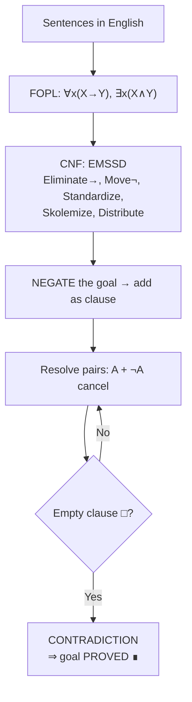

### 16. Forward vs Backward chaining
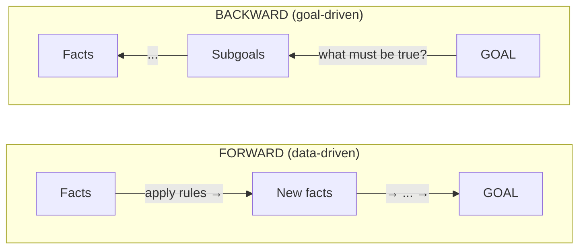
> Forward = cooking with what's in the fridge. Backward = recipe-driven shopping. ES use: diagnosis.

### 17. Bayesian network (Model Q7)
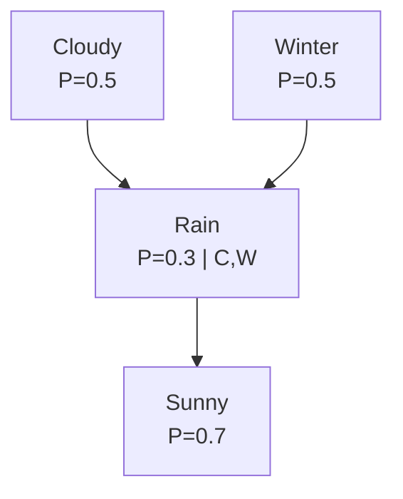
> Joint = Π P(node|parents): P(C,W,R,SU) = P(C)·P(W)·P(R|C,W)·P(SU|...). Label every node with its CPT.

### 18. Fuzzy set sketch
```
μ(x)
1.0 ┤                    ●━━━━━━━
0.5 ┤         ●━━━━━●
0.0 ━●━━━━●━━━━━━━━━━━━━━━━━━━▶ x
     10  20  30  40  50  60  70
     "LARGE": μ = {10:0, 20:.1, 30:.3, 40:.5, 50:.7, 60:.9, 70:1}
```
> Operators: union = **max**, intersection = **min**, complement = **1−μ**.

---

## UNIT 5 — MACHINE LEARNING

### 19. The neuron (mathematical model — MOST important diagram)
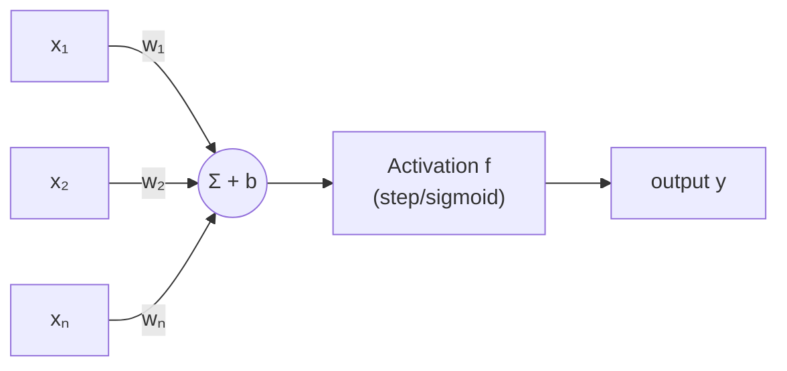
> Formula banner: **y = f(Σwᵢxᵢ + b)**. Bio mapping: dendrite→inputs, synapse→weights, soma→summer, axon→output.

### 20. Sigmoid (draw small graph beside activation answer)
```
σ(x)=1/(1+e⁻ˣ)
1.0 ┤              ╭───────
0.5 ┤         ╭────╯
0.0 ─────────╯─────────────▶ x
              0
```
> Squashes anything to (0,1); smooth & differentiable → enables backprop.

### 21. Multi-layer ANN (for backprop answer)
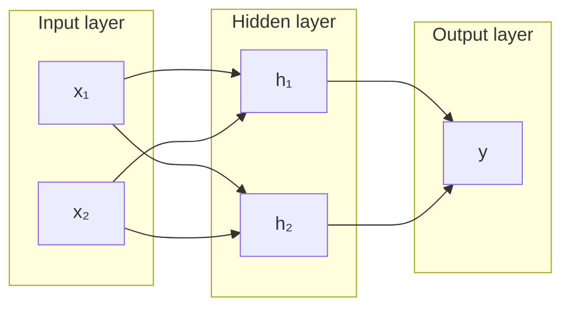
> Backprop arrows: forward ⇒, error flows backward ⇐ (draw dashed arrows back).

### 22. Backprop cycle (5-box loop)
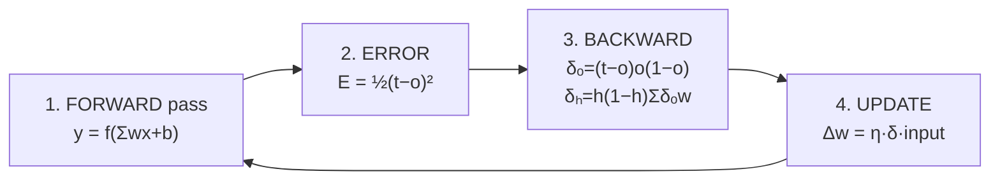

### 23. Hebb net for OR (final trained network)
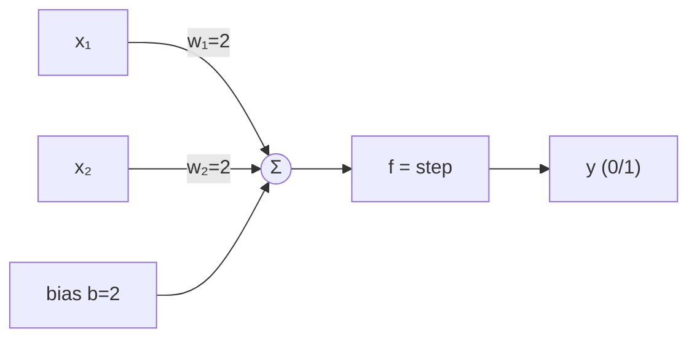
> Show the 4-row training table (Δw = x·t) beside it — final: **w₁=2, w₂=2, b=2**.

### 24. GA crossover (2078 Q7)
```
One-point (after 4th bit):
  Parent1: 0110 │ 0010      Child1: 0110 1100
  Parent2: 1010 │ 1100      Child2: 1010 0010
Two-point (after bit 2 and 6):
  Parent1: 01 │ 1000 │ 10   Child1: 01 1001 10
  Parent2: 10 │ 1001 │ 00   Child2: 10 1000 00
Mutation:  01101100 → 01111100   (one random bit flips)
```

### 25. Supervised vs Unsupervised vs RL (3-panel sketch)
```
SUPERVISED:    [data + answer key] → learn mapping      (spam labels)
UNSUPERVISED:  [data, no labels]   → find clusters      ((•••)(••))
REINFORCEMENT: [agent ⇄ world]     → reward signal      (🎁 for good moves)
```

---

## UNIT 6 — APPLICATIONS

### 26. Expert system (KIUWE — draw for both ES questions)
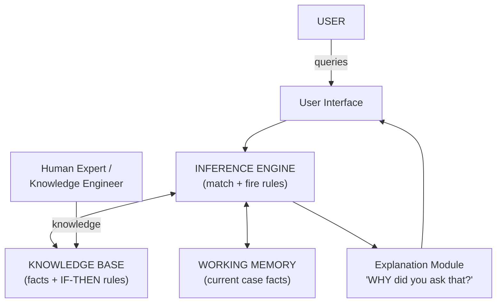

### 27. NLP pipeline (draw as arrow strip)
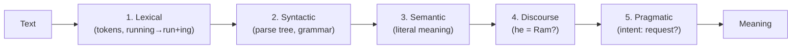
> Mnemonic: **L**azy **S**tudents **S**ee **P**ragmatic **D**iscourse. Example per box = full marks.

### 28. Machine vision system
```mermaid
flowchart LR
    L["Lighting"] --> CAM["Camera/Sensor"]
    CAM --> FG["Frame grabber<br/>(digitize + filter)"]
    FG --> FE["Feature extraction<br/>(edges, patterns)"]
    FE --> DEC["Decision unit<br/>(pass/fail, actuate)"]
```

### 29. Robot hardware
```mermaid
flowchart LR
    subgraph SENSES["Sensors"]
        P1["Proprioceptive:<br/>encoders, gyro,<br/>battery"]
        E1["Exteroceptive:<br/>camera, LiDAR,<br/>sonar, touch"]
    end
    SENSES --> BRAIN["Perception +<br/>Planning"]
    BRAIN --> EFF["EFFECTORS:<br/>motors, grippers,<br/>wheels"]
    EFF --> W["WORLD"]
    W --> SENSES
```

---

## 🎯 Diagram priority (if you only master 8)
1. **Neuron (19)** — appears 6/7 papers
2. **A\* formula box (7) + trace table**
3. **Minimax tree (9)** 
4. **Resolution flow (15)**
5. **Expert system KIUWE (26)**
6. **Agent structure (1)**
7. **NLP pipeline (27)**
8. **Bayesian network (17)**

*In the exam: draw FIRST, explain second. A labeled diagram + 4 bullets ≈ full marks even on a bad day.*
