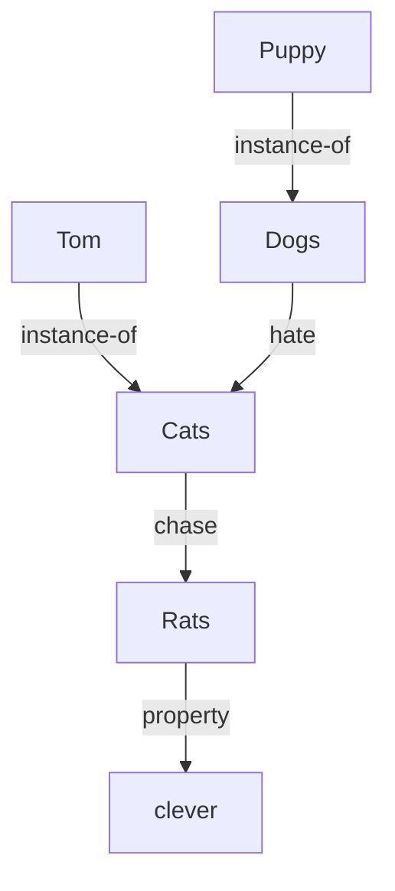
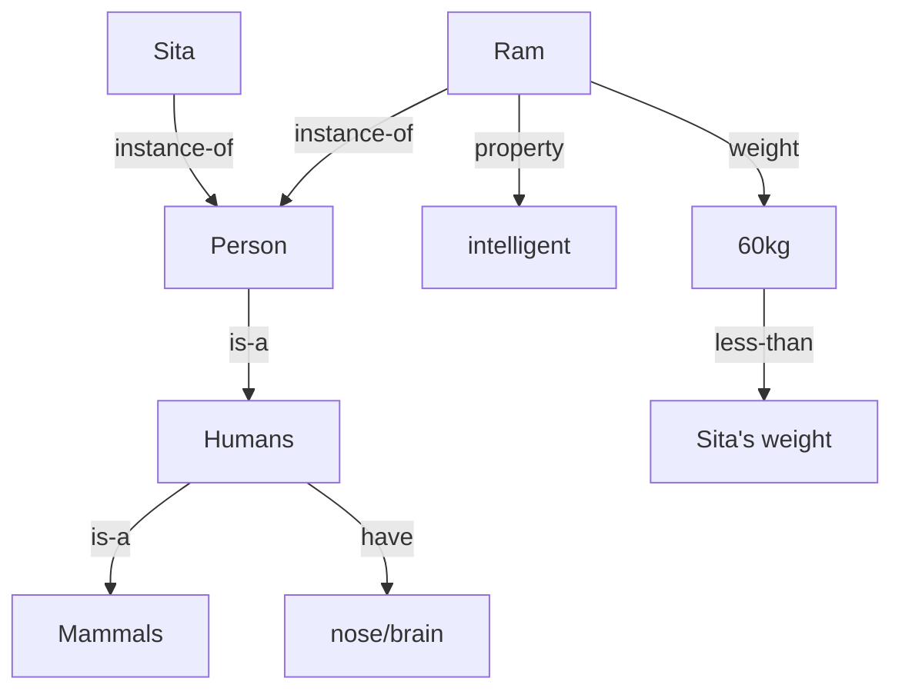

# 🎓 Hour 4 Session Notes — BAYES + KR + THEORY BLITZ

*Hour 4 = the "cheap marks hour". Nothing here is hard — it's diagrams + one formula + mnemonics. This is also the hour to CUT if you're behind (Hour 5's blur drill matters more).*

**Progress checklist:**
```
⬜ Semantic nets (2 constructions)
⬜ Frames (1 construction)
⬜ Bayes numerical (the recipe)
⬜ Belief network (1 computed example)
⬜ Fuzzy set (1 construction + operators)
⬜ Theory blitz: ES / NLP / agents / vision (mnemonics only)
```

---

## 1. SEMANTIC NETS — pure diagram marks

**Recipe:** nouns → nodes (ovals) · relationships → labeled arrows · pronouns/names → instance-of edges · categories → is-a edges.

### ✅ Construction 1 (2082 Q7): "Dogs hate cats. Tom is a cat. Puppy is a dog. Cats chase rats. Rats are clever."

**Inference example to quote:** "Does Puppy chase rats?" → Puppy instance-of Dogs... Dogs hate Cats, Cats chase Rats → through inheritance/chain: yes, plausibly. *"Inference in semantic nets = following links + inheriting class properties."*

### ✅ Construction 2 (Model Q10): Ram facts


## 2. FRAMES — slot-filler boxes with inheritance (2080 Q7)

```
┌ TU: org_type = Educational ┐
│  ┌ DEPARTMENT (is-a TU) ┐  │
│  │  ┌ HR-DEPT (is-a DEPT) ┐ │
│  │  │  employees: 110     │ │
│  │  │  avg_salary: 45000  │ │
│  │  │  ┌ EMPLOYEE: Ram ┐  │ │
│  │  │  │  age: 27      │  │ │
│  │  │  │  sex: male    │  │ │
│  │  │  └───────────────┘  │ │
│  │  └─────────────────────┘ │
│  └──────────────────────────┘
└──────────────────────────────┘
```
One-liner: *"A frame is a record-like structure of slots and fillers; frames linked by is-a inherit slot values from parent frames."*

## 3. BAYES NUMERICAL — the 3-line recipe (marks in EVERY odd year)

```
1. Identify H (hypothesis) and E (evidence) from the story
2. Write:  P(H|E) = P(E|H)·P(H) / P(E)
3. Plug the 3 given numbers, compute
```
**✅ 2078:** P(D|A) = (0.07 × 0.15)/0.05 = **0.21**
**✅ Mock Q7:** (0.90 × 0.20)/0.34 = **0.529**
**Pattern:** the denominator P(E) is either given directly, or = P(E|H)P(H) + P(E|¬H)P(¬H) (total probability) — the mock version gives it directly.

**Full joint (if table given):** P(query | evidence) = (sum cells matching query AND evidence) ÷ (sum cells matching evidence). 2076: 0.42/(0.12+0.42+0.06) = **0.7**.

## 4. BELIEF NETWORKS — draw + multiply

**Definition:** DAG; nodes = random variables; arrows = direct influence; each node stores CPT = P(node|parents); **joint = Π P(Xᵢ|Parents(Xᵢ))**.

**✅ Model Q7 computed:** P(Cloudy)=0.5, P(Winter)=0.5, P(Rain|C,W)=0.3.
P(Cloudy ∧ Winter ∧ Rain) = 0.5 × 0.5 × 0.3 = **0.075**. (Then P(not rain) branch = 0.925; questions usually ask one joint or a conditional — same multiply-then-divide machinery.)

**Reasoning types (name-drop for marks):** causal (top-down), diagnostic (bottom-up), intercausal / "explaining away".

## 5. FUZZY — 5 minutes, guaranteed marks

Construction (2076): X = {10..70}, "LARGE" = {10:0, 20:0.1, 30:0.3, 40:0.5, 50:0.7, 60:0.9, 70:1.0}
**Operators:** A∪B = max · A∩B = min · complement = 1−μ.
**Rulebase system:** fuzzify inputs → fire IF-THEN rules (IF temp HIGH THEN fan FAST) → aggregate → defuzzify (centroid).

## 6. THEORY BLITZ — mnemonics only, 25 minutes

| Question | Your memorized dump |
|---|---|
| Turing test (4/7 papers) | interrogator can't tell machine from human; needs NLP + KR + reasoning + learning |
| Expert systems (4/7) | **KIUWE** + phases Identify→Acquire→Represent→Implement→Test→Deploy; inference engine = brain, matches & fires rules |
| NLP (5/7) | **L-S-S-P-D** + pragmatic example ("pass the salt" = request); why NLP: human-machine interface; challenges: ambiguity |
| Agent types | **Some Monkeys Grab Unripe Lemons** + model-based handles partial observability; utility handles trade-offs |
| Environments | 5 pairs; taxi = partial, stochastic, dynamic, continuous, multi |
| RL/GA/ML | supervised/unsupervised/RL one-liners; passive vs active; model-free = Q-learning; GA = select/crossover/mutate |
| Vision/robotics | light→camera→processor→features→decision; proprioceptive vs exteroceptive |
| Rationality (2082) | max expected utility given percepts + knowledge; moral values live in the utility function humans design |

---

## ⚠️ TRAPS
1. Belief net joint = **multiply CPT entries along the DAG** — don't add.
2. Fuzzy max/min: union takes **max** (more true), intersection takes **min**.
3. Semantic net edge labels matter: instance-of for individuals, is-a for categories.
4. Bayes: the thing you WANT goes on the left of "|", the thing you KNOW is the condition — don't flip.

## POCKET RECAP
```
Semantic net = nodes + labeled arrows (instance-of / is-a / property)
Frame = slots + fillers, is-a inheritance
Bayes: P(H|E) = P(E|H)P(H)/P(E)  ·  Full joint: matching ÷ evidence
Belief net: DAG + CPT, joint = Π P(node|parents)
Fuzzy: μ∈[0,1], max/min/1−μ
Theory = mnemonics: KIUWE · LSSPD · SMGUL · COTS
```

## SELF-TEST
1. Draw the animals semantic net from memory (30 sec)
2. Compute: P(H)=0.25, P(E|H)=0.8, P(E)=0.5 → P(H|E) = 0.4
3. Draw the cloudy/winter/rain net + compute the joint
4. Write the 5 environment pairs + classify chess
5. Recite KIUWE + LSSPD + SMGUL without looking
