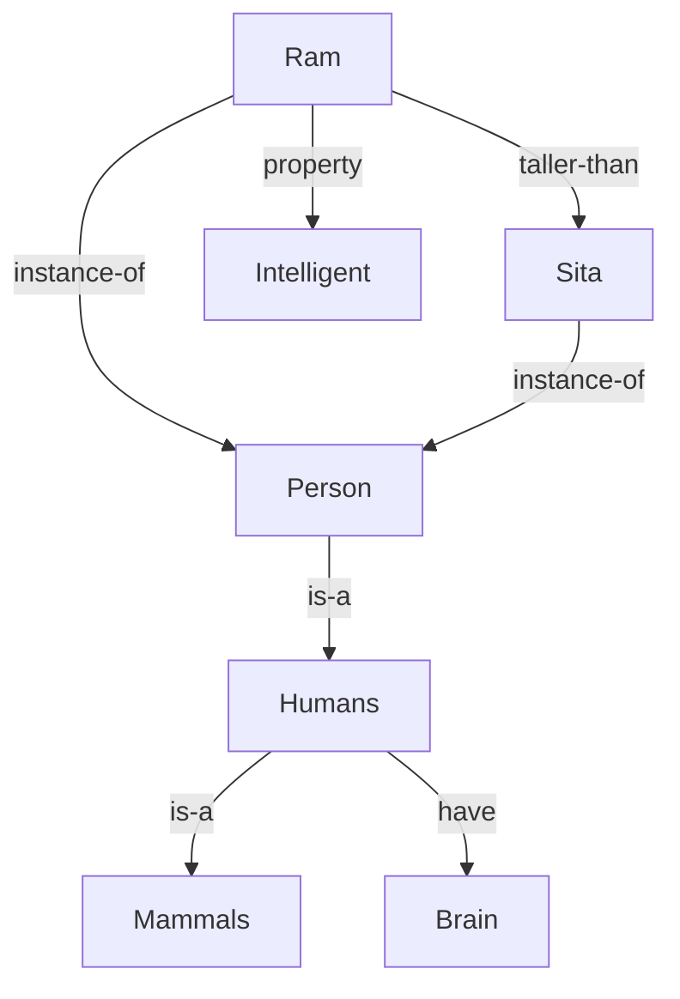

# 📝 Mock Exam 1 — COMPLETE MODEL ANSWERS (exam-hall style)

*This is Mock Exam 1 solved the way you should write it in the hall: full sentences, every diagram, every table, closing lines. Read one question → hide → rewrite → compare. 💡 = why this earns marks.*

---

# SECTION A

## Q1. Informed vs uninformed + Greedy and A* trace [10]

**Part 1 — difference [2 marks]:**

Uninformed (blind) search uses no knowledge about how far a node is from the goal — it explores systematically (BFS, DFS, DLS, IDS, UCS). Informed (heuristic) search uses a heuristic function **h(n)** — an estimate of the cheapest cost from node n to the goal — to guide exploration (Greedy Best-First, A*). Informed search generally expands fewer nodes.

💡 *2 lines + naming both families = full 2.*

**Part 2 — assumptions stated [1]:**
- h: S=8, A=6, B=4, C=2, D=3, G=0 (given)
- Edge costs: S→A=3, S→B=2, A→C=2, B→D=4, C→G=5, D→G=3
- h is admissible (never overestimates the true remaining cost, e.g. h(D)=3 equals D→G=3)

### (a) Greedy Best-First — expand node with lowest h(n)

| Step | Expanded | Frontier (ordered by h) |
|---|---|---|
| 1 | S | A(6), B(4) |
| 2 | B | A(6), D(3) |
| 3 | D | A(6), G(0) |
| 4 | G | — **GOAL** |

**Path: S → B → D → G, total cost = 2+4+3 = 9.**
Closing: Greedy found the goal quickly but it is not complete and not optimal in general, since it ignores g(n).

### (b) A* search — expand node with lowest f(n) = g(n) + h(n)

| Step | Expanded | Frontier (ordered by f = g+h) |
|---|---|---|
| 1 | S (f=8) | A(f=3+6=9), B(f=2+4=6) |
| 2 | B(6) | A(9), D(f=6+3=9) |
| 3 | A(9) | C(f=5+2=7), D(9) |
| 4 | C(7) | D(9), G(f=10+0=10) |
| 5 | D(9) | G(f=(6+3)+0=9) — better path to G found, updated |
| 6 | G(9) | — **GOAL** |

**Path: S → B → D → G, total cost = 9.**
Closing: Since h is admissible, A* is complete and returns the optimal path.

💡 *Trace tables with f-values written at every step = the majority of the marks. The update of G's value in step 5 shows real A* understanding — examiners love it.*

---

## Q2. FOPL conversion + resolution proof: "Gita is studious" [10]

**Step 1 — FOPL [3]:**

| English | FOPL |
|---|---|
| All readers are studious | ∀x (Reader(x) → Studious(x)) |
| All students are readers | ∀x (Student(x) → Reader(x)) |
| Sita is a student | Student(Sita) |
| Gita is a friend of Sita | Friend(Gita, Sita) |
| Friends of students are students | ∀x∀y (Student(y) ∧ Friend(x,y) → Student(x)) |

**Step 2 — CNF clauses [2]:**
```
C1: ¬Reader(y)  ∨ Studious(y)
C2: ¬Student(y) ∨ Reader(y)
C3: Student(Sita)
C4: Friend(Gita, Sita)
C5: ¬Student(y2) ∨ ¬Friend(x, y2) ∨ Student(x)
C6: ¬Studious(Gita)          ← negation of the goal (refutation)
```

**Step 3 — Resolution [4]:**
```
C4 + C5 {x/Gita, y2/Sita}  →  C7: Student(Gita)
C7 + C2 {y/Gita}           →  C8: Reader(Gita)
C8 + C1 {y/Gita}           →  C9: Studious(Gita)
C9 + C6                    →  □  empty clause
```

**Closing line [1]:** Since the negation of the goal produced a contradiction (empty clause), **"Gita is studious" is proved.** ∎

💡 *The 3 marks in FOPL = correct quantifiers + → for "all" + ∧ in the two-variable rule. C3 is a decoy here — never force unused facts into the proof.*

---

## Q3. ANN math model + Hebb OR + perceptron failure [10]

**Part 1 — Mathematical model [3]:**

An ANN is a computing system inspired by biological neurons. The mathematical model of a single neuron:

**y = f(Σᵢ wᵢxᵢ + b)**

```
x₁ ──w₁──┐
x₂ ──w₂──┤    ┌─────────┐      ┌──────────────┐
  ...     ├──>│ Σ wᵢxᵢ+b │ ───> │ activation f │ ───> y
xₙ ──wₙ──┘    └─────────┘      └──────────────┘
```

Biological mapping: **dendrite → inputs, synapse → weights, soma → summer + bias, axon → output.**
The activation function f introduces non-linearity; the sigmoid f(x) = 1/(1+e⁻ˣ) squashes inputs to (0,1) and is differentiable, which enables gradient-based learning.

**Part 2 — Hebb net for OR [4]:**

Hebb rule: **Δw = xᵢ · t** ("neurons that fire together, wire together"). Using bipolar inputs and targets, initial weights w₁ = w₂ = b = 0:

| Step | x₁ | x₂ | t | Δw₁=x₁t | Δw₂=x₂t | Δb=t | w₁ | w₂ | b |
|---|---|---|---|---|---|---|---|---|---|
| 1 | −1 | −1 | −1 | +1 | +1 | −1 | 1 | 1 | −1 |
| 2 | −1 | +1 | +1 | −1 | +1 | +1 | 0 | 2 | 0 |
| 3 | +1 | −1 | +1 | +1 | −1 | +1 | 1 | 1 | 1 |
| 4 | +1 | +1 | +1 | +1 | +1 | +1 | **2** | **2** | **2** |

**Final network: w₁ = 2, w₂ = 2, b = 2** with step activation.
Verification: y = sign(2x₁+2x₂+2) → (−1,−1)→0 ✓, (−1,1)→1 ✓, (1,−1)→1 ✓, (1,1)→1 ✓ — implements OR.

**Part 3 — perceptron failure [3]:**

A single-layer perceptron can only draw **one straight decision line**, so it solves only **linearly separable** problems. XOR's classes ((0,0),(1,1) vs (0,1),(1,0)) cannot be separated by any single line, so the perceptron fails on XOR. This motivates multi-layer networks trained by backpropagation.

---

# SECTION B

## Q4. Rational agent; can AI choose right from wrong? [5]

A rational agent, for each possible percept sequence, selects the action that **maximizes its expected performance measure**, given the evidence from the percept sequence and everything built into the agent.

AI and morality: rationality ≠ morality. An AI maximizes the utility function its human designers gave it — ethical values exist only if they are encoded in that function. It has no consciousness or intention of its own and cannot justify choices morally. Therefore **AI can choose between right and wrong only to the extent its designers encoded ethics into its goals** — e.g. a self-driving car brakes for pedestrians only because avoiding them was built into its performance measure. [💡 definition 2, argument + example 3]

## Q5. PEAS designs [5]

**(a) Kathmandu traffic-monitoring drone:**
- **P:** coverage area per hour, detection accuracy of congestion/accidents, video quality, flight safety, battery efficiency
- **E:** city skies, roads, vehicles, weather (rain/fog), birds, no-fly zones, wireless bandwidth
- **A:** rotors/propellers, camera gimbal, spotlight, radio transmitter to traffic center
- **S:** HD/IR cameras, GPS, altimeter, gyroscope, wind sensor, battery meter

**(b) Online fake-news detector:**
- **P:** classification accuracy, low false-positive rate, processing speed, coverage of sources
- **E:** news articles, social media posts, verified databases, user reports, evolving misinformation tactics
- **A:** labels/flags on content, warnings to users, reports to moderators, ranked feeds
- **S:** text input scraper, source metadata, user interaction data, fact-check database feeds

[💡 all 4 letters with domain-specific content = full marks; generic answers lose 1-2]

## Q6. Hill climbing: C,A,B → A,B,C [5]

h = +1 per correctly positioned block, −1 otherwise; state assumption: list reads top→bottom, one move = take one block and reinsert.

**h(initial = C,A,B):** C✗ A✗ B✗ = **−3**

| Candidate move | New state | h |
|---|---|---|
| Move C to end | A,B,C | **+3** (all correct — GOAL) |
| Move A to end | C,B,A | −1 (only B correct) |
| Move B to end | C,A,B | −3 (unchanged) |

Hill climbing picks the best neighbor → **Move C to end → A,B,C, h = +3 = GOAL** ✓ reached in one step.
**Does it get stuck?** No — here a better neighbor always existed. It would get stuck only at a local maximum/plateau/ridge; fixes: random-restart or simulated annealing. [💡 table with every candidate scored = 3, decision + verdict 2]

## Q7. Posterior probability numerical [5]

**Why posterior:** the prior P(H) is the belief before evidence; after new evidence E arrives, rational decisions must use the **updated belief P(H|E)** — that is the posterior.

**Bayes' rule:** P(H|E) = P(E|H)·P(H) / P(E)

Given: P(Disease) = 0.20, P(Positive|Disease) = 0.90, P(Positive) = 0.34

P(Disease | Positive) = (0.90 × 0.20) / 0.34 = 0.18 / 0.34 = **0.529 ≈ 52.9%**

So a person testing positive has a ~53% chance of actually having the disease. [💡 formula written before plugging = 1 mark most students lose]

## Q8. Semantic network [5]


Each individual (Ram, Sita) links by **instance-of**; categories chain by **is-a**; properties (intelligent, brain, taller-than) are labeled edges. Inference: "Does Sita have a brain?" → Sita instance-of Person, Person is-a Humans, Humans have Brain → **yes** (inheritance). [💡 correct edge labels carry the marks]

## Q9. GA operators + crossover [5]

- **Selection:** fitter chromosomes are chosen as parents (e.g. roulette wheel — probability ∝ fitness)
- **Crossover:** two parents swap gene segments at a chosen point to create children
- **Mutation:** a random bit flips with small probability — maintains diversity and helps escape local optima

**One-point crossover after bit 5:**
```
C1 = 10110 | 011
C2 = 01001 | 100
Child1 = 10110|100 = 10110100
Child2 = 01001|011 = 01001011
```
[💡 draw the two bars with the swap — 1 line of drawing = confirmation marks]

## Q10. Expert system phases + knowledge engineer [5]

1. **Problem identification** — select a narrow, well-bounded domain with an available expert
2. **Knowledge acquisition** — extract facts/rules from the human expert
3. **Knowledge representation/design** — choose structure (rules/frames) and inference strategy
4. **Implementation** — build the knowledge base + inference engine prototype
5. **Testing & evaluation** — compare system decisions against the expert on test cases
6. **Deployment & maintenance** — field use, monitor, update knowledge

**Knowledge engineer:** the bridge between the expert and the system — interviews the expert, captures and structures the knowledge, encodes it into the knowledge base, and iteratively refines it during testing. [💡 mnemonic I AIR the TD]

## Q11. Pragmatic analysis + syntactic vs semantic [5]

**Why pragmatic is necessary:** pragmatic analysis interprets the speaker's **intended meaning using real-world context** — the same sentence can be a question, request or threat depending on context. Example: *"Can you pass the salt?"* — syntactically a question about ability, pragmatically a **request**. Without this layer, a machine responds to literal words instead of meaning.

| | Syntactic | Semantic |
|---|---|---|
| Checks | grammar structure (parse tree) | literal meaning of the sentence |
| Rejects | "girl the go school" | "colorless green ideas sleep furiously" (grammatical but meaningless) |

## Q12. Iterative Deepening Search [5]

IDS runs depth-limited search repeatedly with limits 0, 1, 2, … — combining **DFS's small memory O(bd)** with **BFS's completeness and optimality** (equal step costs). Upper levels are re-expanded each round, but the overhead is small since upper levels have few nodes.

**Example:** tree A→(B,C); B→(D,E); C→(F,G); goal = E at depth 2.

| Limit | Visits | Result |
|---|---|---|
| 0 | A | not found |
| 1 | A, B, C | not found |
| 2 | A, B, D, **E** ✓ | found — path A-B-E |

## Q13. Minimax + alpha-beta [5]

Root = MAX; children = MIN nodes P(leaves 3,5) and Q(leaves 2,9).

- P = min(3,5) = **3**
- Q = min(2,9) = **2**
- Root = max(3,2) = **3** → **MAX chooses move P; game value = 3**

**Alpha-beta:** after exploring P, MAX has α = 3. Exploring Q: its first leaf gives Q's β = 2, and now **β ≤ α (2 ≤ 3)** → prune Q's remaining leaf (9) — it cannot change the root's decision (a beta-cutoff). Same answer, less work.

## Q14. Model-free RL + learning types [5]

**Model-free reinforcement learning:** the agent learns directly from the rewards it receives by trial-and-error, **without learning a model** (transition probabilities) of the environment — e.g. Q-learning.

- **Supervised:** learns from labeled data — mapping inputs to known answers — e.g. spam/not-spam email filter
- **Unsupervised:** finds structure in unlabeled data — e.g. clustering customers by behavior
- **Reinforcement:** learns from reward/penalty signals by acting in an environment — e.g. a robot learning to walk, rewarded for distance moved

## Q15. Fuzzy sets [5]

Let X = {15, 20, 25, 30, 35, 40} °C.

**"HIGH temperature"** (my assumptions): {15:0, 20:0.1, 25:0.3, 30:0.6, 35:0.85, 40:1.0}
**"COLD"** (given): {15:1.0, 20:0.8, 25:0.4, 30:0.1, 35:0, 40:0}

**Union HIGH ∪ COLD = max(μ) per element:**
{15:1.0, 20:0.8, 25:0.4, 30:0.6, 35:0.85, 40:1.0}

**Intersection HIGH ∩ COLD = min(μ) per element:**
{15:0, 20:0.1, 25:0.3, 30:0.1, 35:0, 40:0}

Membership degrees in [0,1] (not crisp 0/1) make these sets fuzzy.

---
---

# 📊 EXAMINER'S SELF-ASSESSMENT

| Q | Max | This script earns | Note |
|---|---|---|---|
| 1 | 10 | 10 | both tables complete, G-update shown |
| 2 | 10 | 10 | full clause chain + substitutions |
| 3 | 10 | 10 | table + verification + XOR story |
| 4 | 5 | 5 | definition + ethics argument |
| 5 | 5 | 5 | domain-specific PEAS ×2 |
| 6 | 5 | 5 | all 3 moves scored |
| 7 | 5 | 5 | formula shown → 0.529 |
| 8 | 5 | 5 | labels + inheritance example |
| 9 | 5 | 5 | definitions + clean crossover |
| 10 | 5 | 5 | 6 phases + KE role |
| 11 | 5 | 5 | request example + both rejects |
| 12 | 5 | 5 | limit table + memory formula |
| 13 | 5 | 5 | values + correct prune reason |
| 14 | 5 | 5 | Q-learning named |
| 15 | 5 | 5 | both operator sets computed |
| **Total** | **60** | **60** | *this is what a full-marks script looks like* |

**How to use this file:** don't read it passively — for each question, look at the question in mock-exam-1.md, write YOUR answer in 3-4 minutes, then diff against this. The diff = your revision list.
