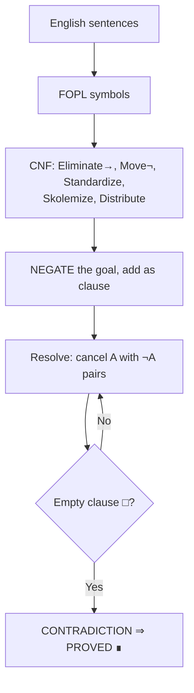
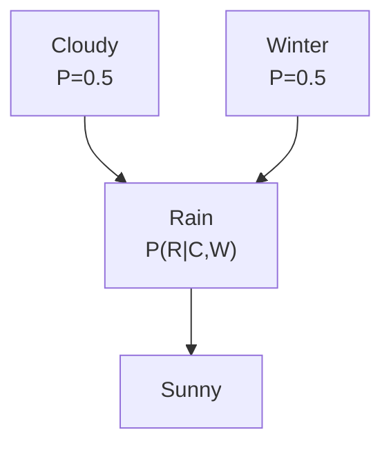
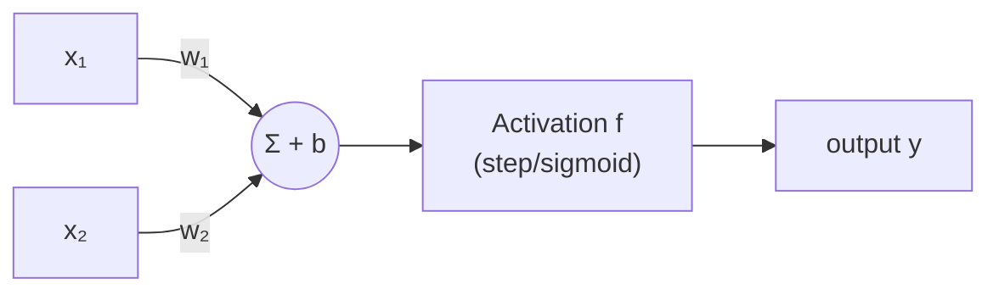
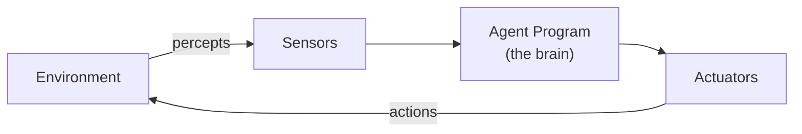
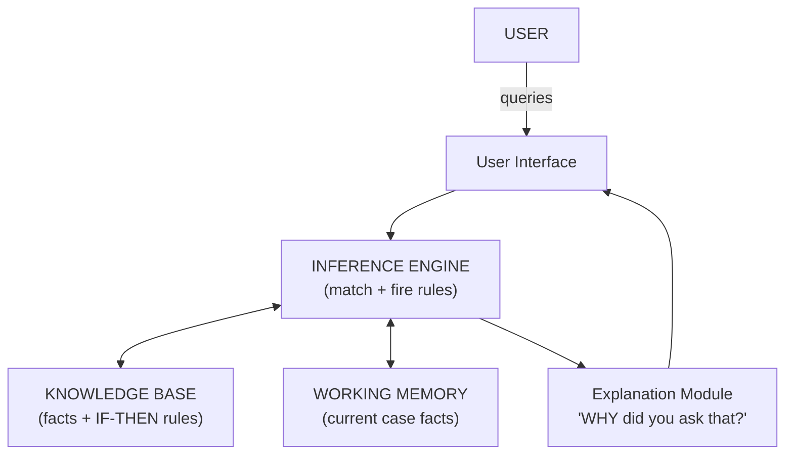
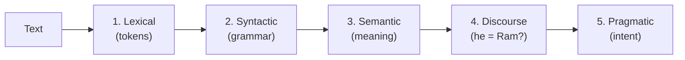

# 🍼 Zero-to-Hero: Understand Every Topic in Plain English (~60 min total)

*Read this ONCE before touching the answer bank. No jargon. Every concept gets: what it actually is → everyday analogy → a picture → the 3 things worth remembering. After this, the answer bank stops being gibberish.*

---

## PART A — SEARCH (finding paths)

**The core idea of the whole unit:** A computer solving a problem = walking through a map of situations ("states") from START to GOAL. Different algorithms = different strategies for exploring the map. That's it.

### 1. BFS vs DFS (breadth vs depth)
- **Plain:** BFS explores the map in rings around the start (all 1-step options, then all 2-step...). DFS picks ONE path and follows it to the end before backtracking.
- **Analogy:** BFS = searching your house room by room floor by floor. DFS = following one corridor to its very end, then backing up.
- **🖼️ Picture it:**
```
        S
       / \
      A   B
     / \   \
    D   E   F      BFS order: S → A → B → D → E → F   (ring by ring)
                   DFS order: S → A → D, then A → E, then B → F (corridor by corridor)
```
- **Remember:** BFS is safe but eats memory; DFS is light but can wander forever. **IDS = DFS that restarts with a deeper limit each round** (get BFS's safety with DFS's small memory).

### 2. Heuristic h(n) — the "guess"
- **Plain:** a smart guess of "how far am I from the goal?" — a number attached to each point on the map. It's a GUESS, not a promise.
- **Analogy:** standing in a city, looking at a tower, estimating "about 2 km to go."
- **🖼️ Picture it:**
```
    S(h=12) ──── A(h=8) ──── E(h=4) ──── G(h=0) ← goal always has h=0
   start        closer      very close   goal
```
- **Remember:** admissible = the guess never OVERestimates (always equal or under the true distance). This matters because A* is only guaranteed optimal when the guess is humble.

### 3. Greedy Best-First
- **Plain:** always expand the point that LOOKS closest to the goal (smallest h). Ignores how far you already walked.
- **Analogy:** always walking toward the tower you see, even if a wall is in the way. Fast, but can trap you in a dead end.
- **Remember:** uses h only → fast, incomplete, not optimal.

### 4. A* — the smart one
- **Plain:** choose the next point by **real distance walked (g) + guess remaining (h)**. Balances "cheap so far" with "promising ahead."
- **Analogy:** taxi driver picking the route by (fare already on the meter) + (estimated fare to destination).
- **🖼️ Picture it:**
```
┌─────────────────────────────────────┐
│  f(n) = g(n) + h(n)                 │
│  g = Gone  (real cost from START)   │
│  h = Hope  (estimated cost to GOAL) │
│  h never overestimates → A* optimal │
└─────────────────────────────────────┘
```
- **Remember:** f = g + h. "g = Gone, h = Hope." If h never overestimates → A* finds the BEST path. That one sentence is the exam answer's heart.

### 5. Hill Climbing
- **Plain:** look at your immediate neighbors, step to the best one, repeat. Stop when no neighbor is better. Keeps NO memory of anything else.
- **Analogy:** climbing a hill in thick fog — you can only feel the slope under your feet.
- **🖼️ Picture it:**
```
                    🏔️ GLOBAL MAX (want to be here)
                   /\
      ⛰️ local    /  \        ⬅ RIDGE: diagonal slope,
      max  ⭕___ /    \___       single steps all feel worse
          /\                ⬅ PLATEAU: flat, no direction
         /  \__________
        /              \____
   ──────────────────────────── ground
```
- **Remember:** you'll reach *a* top... but maybe a small bump (**local maximum**), a flat field (**plateau**), or a diagonal slope (**ridge**). All three = stuck. Fixes: restart randomly, or accept a worse step occasionally (**simulated annealing** — like cooling metal slowly).

### 6. Minimax (game playing: you vs opponent)
- **Plain:** build the tree of possible moves. You (MAX) pick the move with the best outcome ASSUMING the opponent (MIN) always picks your worst outcome. Values bubble up from the bottom: MIN layers take the smallest child, MAX layers take the biggest.
- **Analogy:** chess thinking: "if I go here, he'll do the most painful reply..."
- **🖼️ Picture it:**
```
            A (MAX) = 4          ← you pick the best of the two
           / \
      B (MIN)=3  C(MIN)=4      ← opponent picks your WORST option
      /   |      /   \
     1    3    6      4        ← game outcomes (leaves)
     → answer: A plays toward C
```
- **Remember:** alternate MAX/MIN layers, back values up from leaves, root picks max.

### 7. Alpha-Beta pruning
- **Plain:** minimax, but you SKIP branches that can't possibly change your decision. α = best you've secured, β = best opponent has secured. When α ≥ β → stop looking there.
- **Analogy:** shopping: you already found a phone at Rs 30,000. A shop says "our price starts at Rs 50,000" — you walk away without hearing the rest. The remaining offers can't beat yours.
- **🖼️ Picture it:**
```
      ROOT(MAX) α=3
     /     |      \
   B=3   C=2    D ✂ PRUNED after first leaf (0 ≤ α=3)
   /|\    /|\      /|\
  3 5 6  9 1 2    0 ─ rest never checked
```
- **Remember:** prune when α ≥ β. Same answer as minimax, much faster.

### 8. CSP (Constraint Satisfaction Problem)
- **Plain:** a problem that's just "fill in the blanks without breaking rules." Variables, allowed values, constraints.
- **Analogy:** Sudoku — fill the grid, no repeats allowed. Map coloring — neighbors can't share a color.
- **Remember:** variables + domains + constraints. Solve by backtracking (try, and undo when a rule breaks).

---

## PART B — LOGIC (turning sentences into math)

**The core idea:** the computer can't reason with English. You translate sentences into symbols, then mechanically push symbols around to prove things.

### 9. FOPL (First Order Predicate Logic)
- **Plain:** sentences become math. "All dogs are animals" → ∀x (Dog(x) → Animal(x)). "Some dogs are pets" → ∃x (Dog(x) ∧ Pet(x)).
- **Why → for "all" but ∧ for "some":** "all" says *IF* something is a dog, THEN animal (it'd be wrong to claim everything is a dog AND animal). "Some" actually asserts existence: there IS a thing that is both.
- **Remember:** All X are Y = ∀x(X→Y) · Some X are Y = ∃x(X∧Y) · No X are Y = ∀x(X→¬Y). Names (Laxmi, Ram) are just constants.

### 10. Resolution (the proof machine)
- **Plain:** to prove something is true, assume it's FALSE, then push all sentences around until you crash into a contradiction. Crash = your original claim was true.
- **Analogy:** detective proving suspect is guilty: suppose he's innocent → but then his alibi contradicts camera footage → contradiction → he's guilty.
- **🖼️ Picture it:**

- **Remember:** negate goal → CNF (5 steps) → cancel complementary pairs → □ = proved. Skolemize = give the mysterious "someone" a fake name.

### 11. Forward vs Backward chaining
- **Plain:** two directions of applying rules. Forward: from facts → toward conclusion. Backward: from the goal → back to facts.
- **Analogy:** forward = cooking with whatever's in the fridge. Backward = recipe says "you need ghee" → go check if you have ghee.
- **🖼️ Picture it:**
```
FORWARD (data-driven):   FACTS ──▶ new facts ──▶ ... ──▶ GOAL
BACKWARD (goal-driven):  GOAL ◀── subgoals ◀── ... ◀── FACTS
```
- **Remember:** forward = monitoring/design; backward = diagnosis, expert systems.

### 12. Bayes' rule (updating beliefs)
- **Plain:** you believe something a bit (prior). New evidence arrives. Bayes tells you exactly how much to upgrade your belief (posterior).
- **Analogy:** you think your friend is 15% likely to be home. You see the lights on. Now your belief jumps up.
- **🖼️ Picture it:**
```
   P(H|E) = P(E|H) · P(H) / P(E)
   └──┬──┘  └────────┬────────┘
   updated      how you update:
   belief       (evidence is likely if H true) × (prior) ÷ (evidence overall)
```
- **Remember:** prior = before evidence, posterior = after. Numericals: multiply the two given conditionals, divide by the given marginal. Full joint table: matching cells ÷ evidence cells.

### 13. Bayesian network
- **Plain:** a diagram of what causes what. Arrows = "influences." Each node carries a small probability table given its parents. The whole system's probability = multiply the pieces.
- **Analogy:** family tree of causes: Cloudy and Winter both cause Rain.
- **🖼️ Picture it:**

- **Remember:** DAG + CPT tables; joint = Π P(node | its parents).

### 14. Fuzzy logic
- **Plain:** normal logic is 0 or 1 (true/false). Fuzzy allows 0.4 — "kind of true."
- **Analogy:** "is the water hot?" — crisp says yes/no; fuzzy says 70% hot, which is way more useful for controlling a heater.
- **🖼️ Picture it:**
```
μ(x) (how true "LARGE" is)
1.0 ┤                    ●━━━━
0.5 ┤         ●━━━━━●
0.0 ━●━━━━●━━━━━━━━━━━━━━━━━▶ x
     10  20  30  40  50  60  70
```
- **Remember:** membership μ ∈ [0,1]; combine with max (OR), min (AND), 1−μ (NOT).

### 15. Semantic nets / Frames / Scripts (three ways to store knowledge)
- **Plain:**
  - **Semantic net = mind map.** Bubbles for things, arrows for relations. Machines answer by following arrows and inheriting properties.
  - **Frame = a form to fill.** "EMPLOYEE" form with blank slots, inheriting defaults from parent forms.
  - **Script = the expected scenes of a familiar event.** Restaurant: enter → order → eat → pay → leave.
- **🖼️ Picture it:**
```
SEMANTIC NET:          FRAME:                    SCRIPT:
 Dogs ──hate──▶ Cats   ┌ EMPLOYEE ────────┐      [hungry, has money]
  ▲                     │ name: Ram        │        ↓
  │ instance-of         │ age:  27         │      SCENE1 enter, sit
 Puppy   Tom ─────▶ Cats│ dept: HR-DEPT    │        ↓
                        └──────────────────┘      SCENE2 order → SCENE3 eat
                        (inherits from parent)      → SCENE4 pay, exit
```
- **Remember:** net = graph, frame = slots, script = event sequence.

---

## PART C — LEARNING MACHINES

### 16. Machine Learning's 3 flavors
- **Plain:**
  - **Supervised** = learning WITH an answer key (labeled spam/not-spam emails).
  - **Unsupervised** = no answer key, find structure: group similar customers.
  - **Reinforcement** = learning by rewards, like training a dog: good action → treat.
- **🖼️ Picture it:**
```
SUPERVISED:    [data + ANSWER KEY] → learn the mapping
UNSUPERVISED:  [data, no labels]   → find clusters  ((•••)(••))
REINFORCEMENT: [agent ⇄ world]     → learn from reward signal 🎁
```
- **Remember:** Passive RL = judge a behavior someone else chose; active = choose yourself and explore; **model-free** = learn purely by trial-and-error without a map of the world.

### 17. Neural Network (ANN)
- **Plain:** a fake neuron is just: multiply inputs by weights, add them, squash the result. Learning = nudging the weights until outputs become correct.
- **Analogy:** a tiny voting committee: each input votes with different influence (weight), the chairman sums votes (Σ+b), and decides how strongly to speak (activation squash).
- **🖼️ Picture it:**

- **Remember:** `y = f(Σwx + b)`. Bio mapping: dendrite→inputs, synapse→weights, soma→summer, axon→output. Sigmoid squashes anything into 0–1 smoothly (needed for learning).

### 18. Three learning rules (how weights change)
- **Hebb:** "neurons that fire together, wire together" → Δw = x·t.
- **Perceptron:** if wrong, nudge weights toward the answer: w += η(t−y)x. Only works when a straight line can split the classes — fails XOR.
- **Backpropagation:** forward pass → measure error → send blame BACKWARD through layers → each weight adjusts slightly → repeat.
- **🖼️ Picture it (backprop):**
```
   x₁ ──▶ [h] ──▶ [o] ──▶ output ≠ target = ERROR
   FORWARD ⇒ ⇒ ⇒ ⇒ ⇒ ⇒ ⇒ ⇒ ⇒ ⇒ ⇒ ⇒ ⇒
   BLAME  ⇐ ⇐ ⇐ ⇐ ⇐ ⇐ (flows back, each weight
                       gets a share, adjusts a little)
```
- **Analogy:** a bad restaurant review: manager blames waiter? kitchen? supplier? — blame flows down the chain, everyone adjusts a little, next customer gets better food.

### 19. Genetic Algorithm
- **Plain:** solving problems by *breeding answers*. Score candidates (fitness), best become parents, parents swap parts (crossover) with rare random typos (mutation), repeat for generations.
- **Analogy:** breeding dogs — pick the fastest two, pups are usually fast, add a rare surprise gene, after generations you get a greyhound.
- **🖼️ Picture it:**
```
Parent1: 0110 │ 0010          One-point crossover:
Parent2: 1010 │ 1100          swap tails →
Child1:  0110 1100
Child2:  1010 0010
Mutation: 01101100 → 01111100 (one random bit flips)
```
- **Remember:** selection → crossover → mutation, driven by the fitness function.

---

## PART D — AGENTS & APPLICATIONS

### 20. Agent + PEAS
- **Plain:** an agent = anything that SENSES and ACTS. **PEAS = its job description:** Performance (success), Environment (where), Actuators (what it can do), Sensors (what it can sense).
- **Analogy:** hiring a driver: "drives safely & fast" (P), "city roads" (E), "hands & feet" (A), "eyes & GPS" (S).
- **🖼️ Picture it:**

- **Agent types ladder:** reflex (if-then, no memory) → model-based (remembers what it can't see) → goal-based (acts toward target) → utility-based (compares HOW GOOD outcomes are) → learning (improves over time).
- **Environment words:** static/dynamic, deterministic/stochastic, observable/partial, single/multi-agent.

### 21. Turing Test
- **Plain:** chat with something hidden; if you can't tell whether it's human — it's intelligent. Tests behavior, not brain.
- **🖼️ Picture it:**
```
            ┌── [Human]  ←──┐
Interrogator│               │  "which one is human?"
 (judge)    └── [Machine] ←──┘
 pass = judge can NOT reliably tell
```
- **Remember:** passing needs: language, knowledge, reasoning, learning.

### 22. Expert System
- **Plain:** a doctor-in-a-box: captures a human expert's rules in a Knowledge Base; an Inference Engine fires those rules against your symptoms to reach a conclusion, explaining its reasoning.
- **🖼️ Picture it:**

- **Remember (KIUWE):** Knowledge base, Inference engine, User interface, Working memory, Explanation module. Built by: identify → acquire → represent → implement → test → deploy.

### 23. NLP (5 steps)
- **Plain:** how a machine digests a sentence: ① read the words → ② check grammar → ③ get literal meaning → ④ connect with previous sentences (who is "he"?) → ⑤ get the real intent.
- **🖼️ Picture it:**

- **Remember:** Lazy Students See Pragmatic Discourse. "Can you pass the salt?" — pragmatic: a REQUEST, not an ability question. Challenges = ambiguity everywhere.

### 24. Machine Vision & Robotics
- **Plain:** vision = machine understanding images. Robot = body with **sensors** (own state: gyro; world: camera, LiDAR, touch) and **effectors** (motors, grippers).
- **🖼️ Picture it:**
```
VISION:  Lighting → Camera → Processor → Features → Decision
ROBOT:   [Sensors: own state + world] → Brain → [Effectors] → World
         (vision = the robot's EYES feeding navigation)
```
- **Remember:** proprioceptive = own body, exteroceptive = outside world; effectors = actuators that move it.

---

## 🎯 Your actual study flow now (nothing left unexplained)

1. **Read this file once, casually** — 45–60 min. You now know what every word means AND have a mental picture of each. (Don't memorize anything here.)
2. **Do the answer bank unit by unit** — now each memorized paragraph will *click* instead of being noise.
3. **Draw each diagram once** — neuron, expert system boxes, search table, semantic net (the full gallery lives in `diagrams.md`).
4. **Blur test at the end** — rewrite 5 random answers from memory, patch gaps.

You don't need deep knowledge — you need *just enough understanding that memorization sticks*. This file + answer bank = exactly that. 💪
